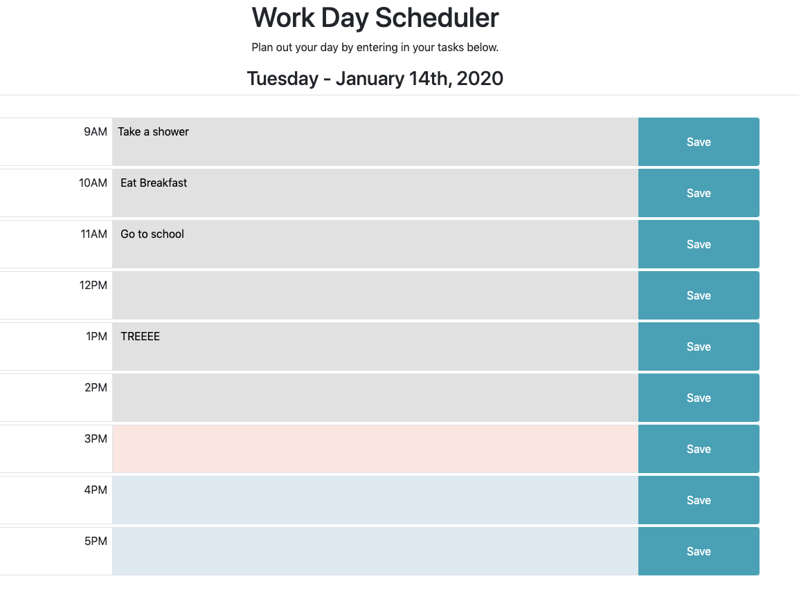

# Unit 05 Third-Party APIs Homework: Day Planner

This assignment is a day planner application where a user can enter in tasks based on the standard work hours (from 9am - 5pm). 

After a user enters in their tasks, they can save their entry for reference. Clicking on the save button places their updated task into their local storage.

The text areas are color-coded to indicate whether the hour is in the past, present, or future.

* An hour that already took place is gray (#e1e1e1);
* An hour that is currently taking place is red (#FCE5E0)
* An hour that is taking place in the futue is blue (#DCE9F3).

